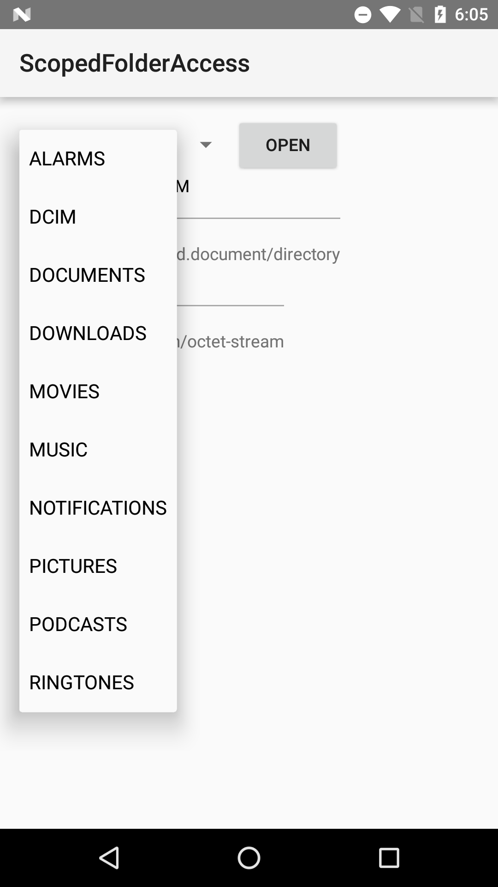

Android ScopedDirectoryAccess Sample
===================================

This sample demonstrates how to use the Scoped Directory Access API introduced in Android N
to easily access to specific directories such as Pictures, Downloads instead of requesting
READ_EXTERNAL_STORAGE or WRITE_EXTERNAL_STORAGE in your manifest.

Introduction
------------

This sample demonstrates how to use the Scoped Directory Access API that provides easy way to
access specific directories instead of:
 - Requesting READ_EXTERNAL_STORAGE or WRITE_EXTERNAL_STORAGE in your manifest, which allows
   access to all public directories on external storage.
 - Using the Storage Access Framework, where the user usually picks directories via a System UI,
   which is unnecessary if you app always accesses to the same external directory.

To access to a specific directory, use a new Intent created using the StorageVolume class like
following:

```
StorageManager sm = getSystemService(StorageManager.class);
StorageVolume volume = sm.getPrimaryVolume();
Intent intent = volume.createAccessIntent(Environment.DIRECTORY_PICTURES);
startActivityForResult(intent, request_code);
```

Note that the argument passed to StorageVolume.createAccessIntent needs to be one of the
values of Environment.DIRECTORY_\*.

Once the user grants the access, `onActivityResult` override will be called with a
result code of `Activity.RESULT_OK` and an intent data that contains the URI representing
the directory.

Pre-requisites
--------------

- Android SDK 24
- Android Build Tools v23.0.3
- Android Support Repository

Screenshots
-------------

   

Getting Started
---------------

This sample uses the Gradle build system. To build this project, use the
"gradlew build" command or use "Import Project" in Android Studio.

Support
-------

- Google+ Community: https://plus.google.com/communities/105153134372062985968
- Stack Overflow: http://stackoverflow.com/questions/tagged/android

If you've found an error in this sample, please file an issue:
https://github.com/googlesamples/android-ScopedDirectoryAccess

Patches are encouraged, and may be submitted by forking this project and
submitting a pull request through GitHub. Please see CONTRIBUTING.md for more details.

License
-------

Copyright 2016 The Android Open Source Project, Inc.

Licensed to the Apache Software Foundation (ASF) under one or more contributor
license agreements.  See the NOTICE file distributed with this work for
additional information regarding copyright ownership.  The ASF licenses this
file to you under the Apache License, Version 2.0 (the "License"); you may not
use this file except in compliance with the License.  You may obtain a copy of
the License at

http://www.apache.org/licenses/LICENSE-2.0

Unless required by applicable law or agreed to in writing, software
distributed under the License is distributed on an "AS IS" BASIS, WITHOUT
WARRANTIES OR CONDITIONS OF ANY KIND, either express or implied.  See the
License for the specific language governing permissions and limitations under
the License.
